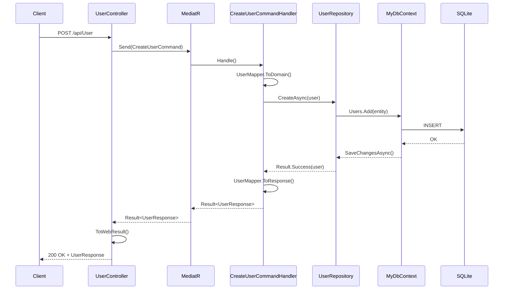
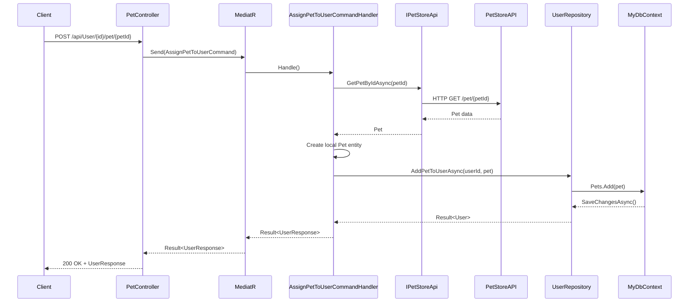
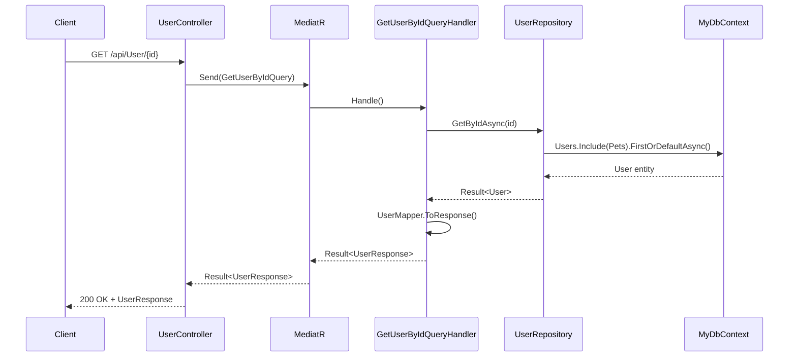
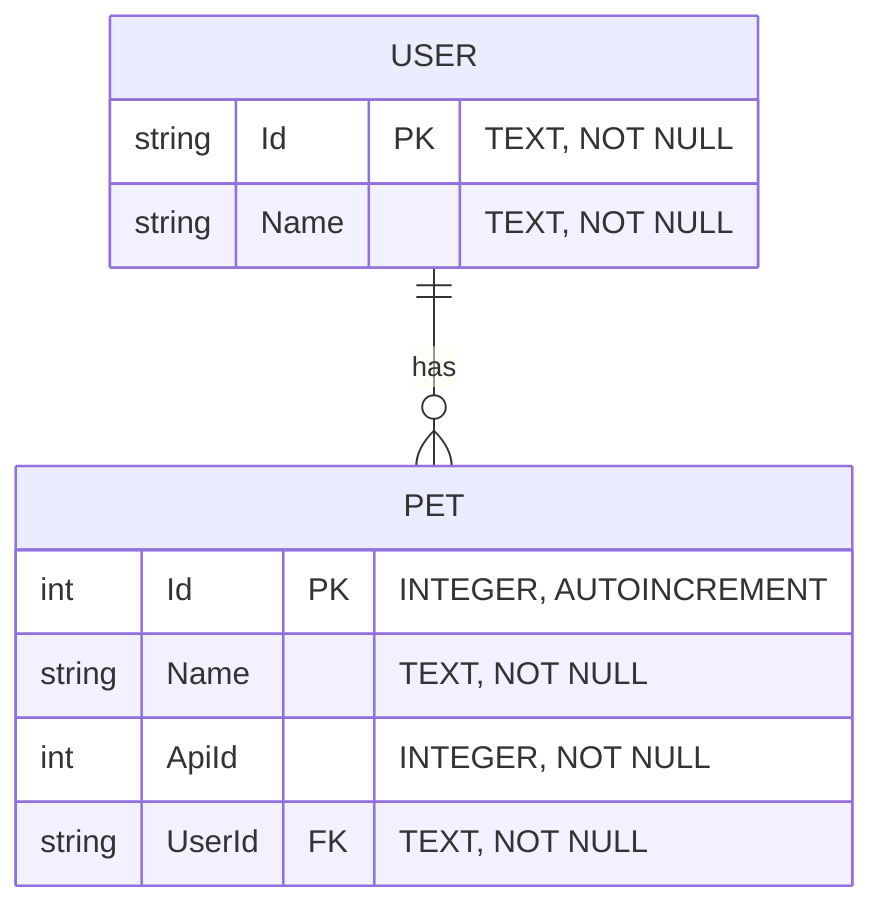

# Architecture Documentation

## Overview

AiMiniSample is a .NET 10 Web API implementing a clean architecture pattern with CQRS (Command Query Responsibility Segregation) using MediatR. The application manages Users and Pets, integrating with an external PetStore API.

## Technology Stack

| Component | Technology |
|-----------|------------|
| Framework | .NET 10 |
| Database | SQLite with Entity Framework Core 10 |
| CQRS/Mediator | MediatR 14.0.0 |
| API Generation | OpenAPI Generator |
| Functional Extensions | CSharpFunctionalExtensions 3.6.0 |

## Architecture Layers

```
┌─────────────────────────────────────────────────────────────┐
│                    Controllers Layer                         │
│  (UserController, PetController, DebugController)           │
├─────────────────────────────────────────────────────────────┤
│                    Features Layer (CQRS)                     │
│  Commands: Create, Update, Delete, AssignPet                │
│  Queries: GetById, GetAll, GetPetsOfUser                    │
├─────────────────────────────────────────────────────────────┤
│                    Persistence Layer                         │
│  Repositories: IUserRepository, UserRepository              │
├─────────────────────────────────────────────────────────────┤
│                    External APIs Layer                       │
│  IPetStoreApi, PetStoreApi (wraps PetStoreClient)          │
├─────────────────────────────────────────────────────────────┤
│                    Database Layer                            │
│  MyDbContext, SQLite (app.db)                               │
└─────────────────────────────────────────────────────────────┘
```

## Key Components

### Controllers

- [`TestController`](AiMiniSample/Controllers/UserController.cs) - Handles User CRUD operations
- [`PetController`](AiMiniSample/Controllers/PetController.cs) - Handles Pet assignment and retrieval
- [`DebugController`](AiMiniSample/Controllers/DebugController.cs) - Database management endpoints

### Features (CQRS Pattern)

**Commands:**
- [`CreateUserCommand`](AiMiniSample/Features/Users/Commands/CreateUserCommand.cs)
- [`UpdateUserCommand`](AiMiniSample/Features/Users/Commands/UpdateUserCommand.cs)
- [`DeleteUserCommand`](AiMiniSample/Features/Users/Commands/DeleteUserCommand.cs)
- [`AssignPetToUserCommand`](AiMiniSample/Features/Pets/Commands/AssignPetToUserCommand.cs)

**Queries:**
- [`GetUserByIdQuery`](AiMiniSample/Features/Users/Queries/GetUserByIdQuery.cs)
- [`GetAllUsersQuery`](AiMiniSample/Features/Users/Queries/GetAllUsersQuery.cs)
- [`GetPetsOfUserQuery`](AiMiniSample/Features/Pets/Queries/GetPetsOfUserQuery.cs)

### Persistence

- [`IUserRepository`](AiMiniSample/Persistence/Repositories/IUserRepository.cs) - Repository interface
- [`UserRepository`](AiMiniSample/Persistence/Repositories/UserRepository.cs) - EF Core implementation
- [`MyDbContext`](AiMiniSample/DatabaseContext/MyDbContext.cs) - Entity Framework DbContext

### External APIs

- [`IPetStoreApi`](AiMiniSample/Apis/IPetStoreApi.cs) - Abstraction for PetStore API
- [`PetStoreApi`](AiMiniSample/Apis/PetStoreApi.cs) - Implementation wrapping generated client

## Sequence Diagrams

### Create User Flow



### Assign Pet to User Flow



### Get User By ID Flow



## Database Entity Diagram



### Entity Relationships

| Relationship | Type | Description |
|--------------|------|-------------|
| User → Pet | One-to-Many | A user can have multiple pets |
| Pet → User | Many-to-One | Each pet belongs to one user |

### Delete Behavior

- **Cascade Delete**: When a User is deleted, all associated Pets are automatically deleted

### Entity Classes

- [`User`](AiMiniSample/Database_Tables/User.cs) - User entity with Id, Name, and Pets collection
- [`Pet`](AiMiniSample/Database_Tables/Pet.cs) - Pet entity with Id, Name, ApiId, UserId, and User navigation

## Dependency Injection Configuration

```csharp
// Program.cs configuration
builder.Services.AddApis();           // IPetStoreApi, IPetApi
builder.Services.AddPersistence();    // MyDbContext, IUserRepository
builder.Services.AddMediatR(...);     // Command/Query handlers
builder.Services.AddControllers();    // API Controllers
```

### Service Lifetimes

| Service | Lifetime |
|---------|----------|
| `MyDbContext` | Scoped |
| `IUserRepository` | Scoped |
| `IPetStoreApi` | Transient |
| `IPetApi` | Transient |

## API Endpoints

| Method | Endpoint | Description |
|--------|----------|-------------|
| GET | `/api/User` | Get all users |
| GET | `/api/User/{id}` | Get user by ID |
| POST | `/api/User` | Create new user |
| PUT | `/api/User/{id}` | Update user |
| DELETE | `/api/User/{id}` | Delete user |
| GET | `/api/User/{id}/pet` | Get pets of user |
| POST | `/api/User/{id}/pet/{petId}` | Assign pet to user |
| POST | `/api/Debug/clear-db` | Clear database |

## Error Handling

The application uses [`CSharpFunctionalExtensions.Result<T>`](AiMiniSample/Common/Extensions.cs) for railway-oriented programming:

- **Success**: Returns `OkObjectResult` with data
- **Failure**: Returns `NotFoundObjectResult` with error message

## Generated Code

Two OpenAPI generators are used:

1. **Server API** ([generate-api.sh](generate-api.sh)): Generates abstract controller base classes
2. **Client API** ([generate-client.sh](generate-client.sh)): Generates PetStore client for external API calls